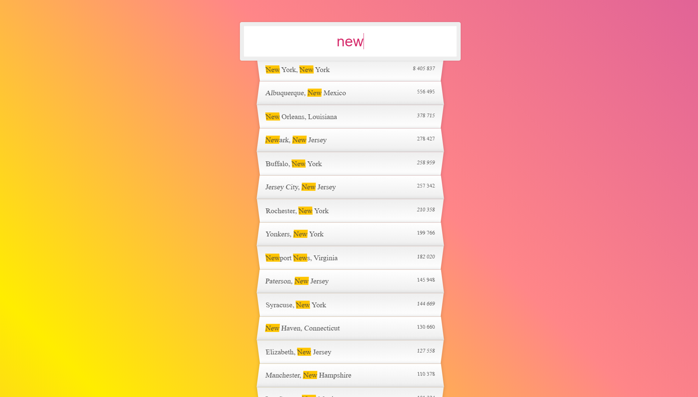

# JavaScript 30 Challenge. Day 6 Search

> Based on https://javascript30.com/

## WHAT IT DOES
* Fetches data of US cities from 'https://gist.githubusercontent.com/Miserlou/c5cd8364bf9b2420bb29/raw/2bf258763cdddd704f8ffd3ea9a3e81d25e2c6f6/cities.json'
* Matches and displays data

## WHAT WAS NICE
* To play with regular expressions